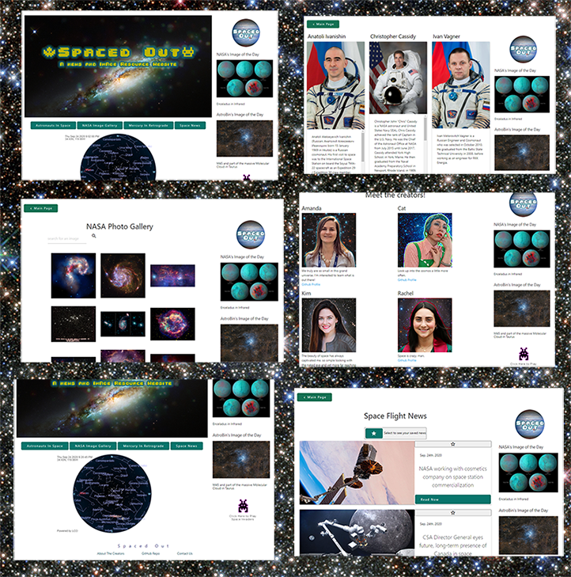

# Spaced Out

## Purpose
Spaced Out is a destination for all us nerds that want to see the happenings in the space world. 

## Built With
* HTML5
* CSS
* Javascript
* jQuery
* Materialize
* Moment.js
* Adobe Photoshop

## Website
[Click here for our active Spaced Out Website!](https://rawagschal.github.io/spaced-out/ "SPACED OUT!")

## Application Features
* NASA and AstroBin's Images of the Day 
* Searchable NASA Image Gallery
* Interactive map of the constellations 
* Information on the astronauts currently in space
* Space-related news feed
* The current status and description of Mercury's retrograde
* In-site Space Invaders with high score board 

## APIs Used
* Nasa (2)
* Astrobin
* Spaceflight News
* Space Launch Now
* Mercury Retrograde

## Screenshots
Below is a gif of __Spaced Out__ in action and below that is the screenshot.

## Contribution
Made with ❤️ by the Spaced Out Team:
Amanda Guerriero, Cat Morgan, Kim Mulligan, Rachel Wagschal!

* Space News Feed, Astronauts in Space, and Images of the Day: Amanda Guerriero
* Interactive Constellation Map, Styling, and Mercury in Retrograde: Cat Morgan
* Space Invader Integration: Kim Mulligan
* NASA Image Gallery: Rachel Wagschal

### License
*Copyright ©️ 2020 Spaced Out*

